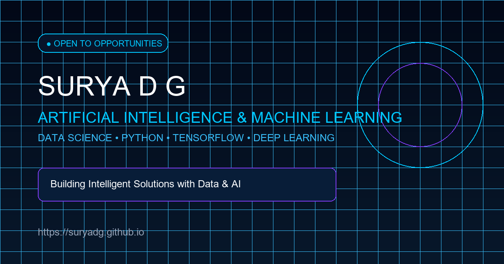

# SURYA D G — Professional AI / ML & Data Science Portfolio

> Production-ready, futuristic personal portfolio website for **Surya D G**, Artificial Intelligence & Machine Learning Student and Data Science Professional. Built with React, Vite, Modern CSS Design System, and GitHub Pages automated deployment.



---

## 🌟 Key Features

- **Futuristic AI / Data Science Visual Identity**: Deep navy background gradients (`#020817`), neon cyan highlights (`#00C8FF`), glassmorphism UI cards, and interactive canvas neural background.
- **Verified Credentials & Internship Showcase**: Interactive certification cards with direct Credly / SkillsNetwork credential verification links and full-resolution lightbox viewer.
- **Dynamic Skills Pillars**: Visually highlighted top 5 skills (Artificial Intelligence, Machine Learning, Python, Data Science, Deep Learning) and categorized technical competencies without fake percentage numbers.
- **Chronological Learning Journey**: Interactive milestone timeline mapping certifications, internship training, and academic progress from 2024 through 2026.
- **Mobile First & Fully Responsive**: Optimized across 320px to 1920px screen sizes with touch-safe drawers, horizontal milestone scrolling, and reduced motion accessibility.
- **Zero Fake Data Policy**: Intelligent auto-hiding for empty social links, missing email addresses, or unpopulated university fields.
- **Full SEO & Accessibility**: Built-in JSON-LD `Person` schema, Open Graph / Twitter cards, XML sitemap, `robots.txt`, Web Manifest, and keyboard focus states.

---

## 🛠️ Technology Stack

- **Framework**: React 18 + Vite
- **Styling**: Modern Vanilla CSS, CSS Variables, Flexbox, CSS Grid
- **Icons**: Lucide React Icons (`lucide-react`)
- **Animations**: Hardware-accelerated CSS Keyframe Animations & Intersection Observer API
- **Deployment**: Free static deployment via GitHub Pages (`.github/workflows/deploy.yml`)

---

## 📁 Project Folder Structure

```
surya/
├── .github/
│   └── workflows/
│       └── deploy.yml              # Automated GitHub Pages CI/CD Action
├── public/
│   ├── favicon.ico                 # SDG Monogram Favicons Suite
│   ├── favicon-16x16.png
│   ├── favicon-32x32.png
│   ├── apple-touch-icon.png
│   ├── android-chrome-192x192.png
│   ├── android-chrome-512x512.png
│   ├── manifest.webmanifest        # Progressive Web App Manifest
│   ├── robots.txt                  # Search Engine Crawler Guidance
│   ├── sitemap.xml                 # Search Engine XML Sitemap
│   └── og-image.png                # 1200x630 Social Share Open Graph Banner
├── src/
│   ├── assets/
│   │   └── certificates/           # Standardized Certificate Images
│   │       ├── ai-fundamentals.jpg
│   │       ├── ai-ml-internship-averixis.jpg
│   │       ├── python-internship-codtech.jpg
│   │       ├── rdbms-ibm.jpg
│   │       ├── lifelong-professional-skills.jpg
│   │       ├── project-management-fundamentals.jpg
│   │       ├── data-science-internship-tech-vedhu.jpg
│   │       └── deep-learning-tensorflow.jpg
│   ├── components/
│   │   ├── Preloader.jsx           # SDG 1s Neural preloader animation
│   │   ├── ScrollProgress.jsx      # Top cyan progress line
│   │   ├── CustomCursor.jsx        # Desktop glow follower
│   │   ├── Navbar.jsx              # Sticky glass navbar with active section indicator
│   │   ├── NeuralBackground.jsx    # Interactive canvas AI neural particle network
│   │   ├── Hero.jsx                # High-impact Hero with typewriter text & AI visual
│   │   ├── About.jsx               # About Surya, mini info cards & career goal
│   │   ├── Stats.jsx               # Verified count cards with animated numbers
│   │   ├── Skills.jsx              # Categorized skills, top 5 highlighted
│   │   ├── Experience.jsx          # Vertical timeline with certificates view button
│   │   ├── FeaturedCertifications.jsx # Spotlight top 3 certifications
│   │   ├── Certifications.jsx      # Filterable certification grid with search & filters
│   │   ├── CertificateModal.jsx    # Image Lightbox / Modal for certificates view
│   │   ├── Education.jsx           # AI/ML degree focused view with configurable fields
│   │   ├── Projects.jsx            # Graceful empty state ("Projects are being prepared...")
│   │   ├── Journey.jsx             # Chronological timeline with horizontal mobile scroll
│   │   ├── Contact.jsx             # LinkedIn & Email action buttons
│   │   ├── Footer.jsx              # Structured footer with copyright & links
│   │   └── BackToTop.jsx           # Floating scroll-to-top button
│   ├── data/
│   │   ├── profile.js              # User profile & contact configurations
│   │   ├── skills.js               # Categorized skills & top skills
│   │   ├── experience.js           # Internships timeline & certificate mapping
│   │   ├── certifications.js       # IBM & verified credentials data
│   │   ├── education.js            # Academic degree configuration
│   │   ├── projects.js             # Projects list (ready for future entries)
│   │   └── journey.js              # Chronological milestone events (2024-2026)
│   ├── styles/
│   │   ├── global.css              # Global design tokens & CSS variables
│   │   ├── animations.css          # Master named keyframe animations
│   │   └── responsive.css          # Breakpoints (320px to 1920px)
│   ├── App.jsx                     # Master App component with reveal observers
│   └── main.jsx                    # Vite React entrypoint
├── index.html                      # SEO metadata, OpenGraph, JSON-LD Person Schema
├── vite.config.js                  # Vite build configuration (base: './')
├── package.json                    # Project dependencies
└── README.md                       # Documentation
```

---

## 💻 Local Development Setup

### 1. Prerequisites
Ensure you have **Node.js (v18+)** and **npm** installed on your system.

### 2. Clone / Open Workspace
```bash
cd surya
```

### 3. Install Dependencies
```bash
npm install
```

### 4. Start Development Server
```bash
npm run dev
```
Open your browser and navigate to `http://localhost:5173`.

### 5. Build for Production
```bash
npm run build
```
The compiled static assets will be output in the `dist/` directory.

---

## 🚀 GitHub Pages Free Deployment

### Method 1: Automatic Deployment (Recommended)
1. Initialize a Git repository (if not already done) and commit all files:
   ```bash
   git init
   git add .
   git commit -m "Initial commit: Surya D G Portfolio"
   ```
2. Create a repository on GitHub (e.g. `surya-portfolio` or `suryadg.github.io`).
3. Connect your local repository to GitHub and push to `main`:
   ```bash
   git remote add origin https://github.com/suryadg/surya-portfolio.git
   git branch -M main
   git push -u origin main
   ```
4. On GitHub, go to **Settings > Pages > Build and deployment > Source**: select **GitHub Actions**.
5. The included workflow (`.github/workflows/deploy.yml`) will automatically build and publish your portfolio site on every push!

---

## ⚙️ How to Customize Data

### 1. Update Profile & Social Links
Open `src/data/profile.js`:
- Set `email: "your.email@domain.com"` (the Email button automatically appears in Navbar and Contact sections once filled).
- Set `github: "https://github.com/yourusername"` (the GitHub icon appears automatically).
- Set `resume: "/resume.pdf"` (the Download Resume button appears automatically).

### 2. Add Future Projects
Open `src/data/projects.js` and add project objects to the `projects` array:
```javascript
export const projects = [
  {
    id: "project-1",
    title: "AI-Powered Predictive Analytics",
    shortDescription: "Machine learning pipeline for predictive modeling using Python & TensorFlow.",
    problem: "Automating data preprocessing for real-time model evaluation.",
    solution: "Trained neural network models integrated with RDBMS database storage.",
    image: "/assets/projects/project1.png",
    techStack: ["Python", "TensorFlow", "Scikit-Learn", "RDBMS"],
    githubUrl: "https://github.com/suryadg/project1",
    liveDemoUrl: "https://demo.example.com",
    status: "Completed"
  }
];
```

### 3. Add or Update Certificates
1. Save your certificate JPG file into `src/assets/certificates/`.
2. Import the image in `src/data/certifications.js` and append your credential details.

---

## 📄 License & Credits

Designed and built for **Surya D G**. All rights reserved.
